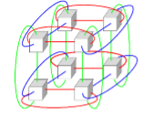
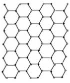
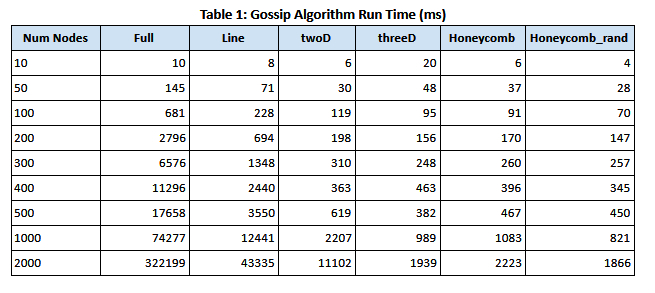
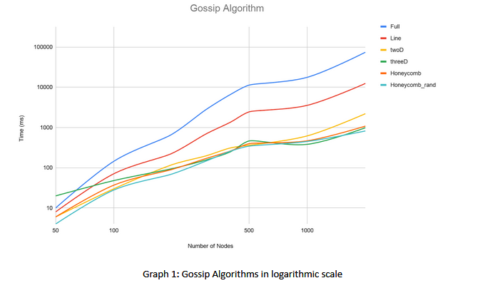
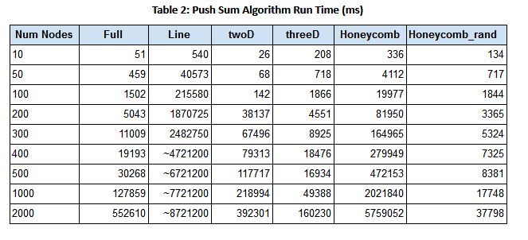
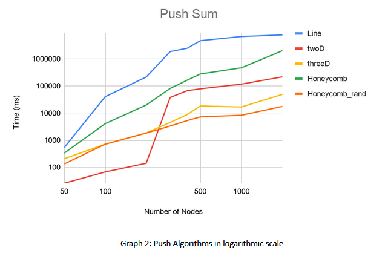

# Gossip_Algorithm

## About 
In this project, two algorithms are implemented (using Elixir actor model) - Gossip Algorithm and Push Sum algorithm and their convergence is evaluated for various complex topologies like Honeycomb and Three dimensional torus grid. Then we analyse the convergence of the algorithms in O(log N) time where N is the number of participants/users.

## Gossip Algorithm 
Gossip protocols can be used to propagate information in a manner rather similar to the way that a viral infection spreads in a biological population. Indeed, the mathematics of epidemics are often used to model the mathematics of gossip communication. The term epidemic algorithm is sometimes employed when describing a software system in which this kind of gossip-based information propagation is employed. The gossip algorithm converges (ie. every user receives the rumor) in O(log N) time.

## Push-Sum Algorithm
This algorithm uses Gossip to get the information like aggregate or sum

## Topologies 

- **Full Network**: Every actor is a neighbor of all other actors. That is, every actor can talk directly to any other actor. 

- **Line**: Actors are arranged in a line. Each actor has only 2 neighbors (one left and one right, unless you are the first or last actor). 

- **Random 2D Grid**: Actors are randomly position at x, y coordinates on a [01.0] x [0-1.0] square. Two actors are connected if they are within .1 distance to other actors. 

- **3D torus Grid**: Actors form a 3D grid. The actors can only talk to the grid neighbors. And, the actors on outer surface are connected to other actors on opposite side, such that degree of each actor is 6. 

  

- **Honeycomb**: Actors are arranged in form of hexagons. Two actors are connected if they are connected to each other. Each actor has maximum degree 3. 
  

  

 
- **Honeycomb with a random neighbor**: Actors are arranged in form of hexagons (Similar to Honeycomb). The only difference is that every node has one extra connection to a random node in the entire network.  
 

## Performance Analysis
The table and the graph below shows the time it takes for various topologies to converge in Gossip protocol

  

  

The table and the graph below shows the time it takes for various topologies to converge in Push_Sum protocol

  

  

